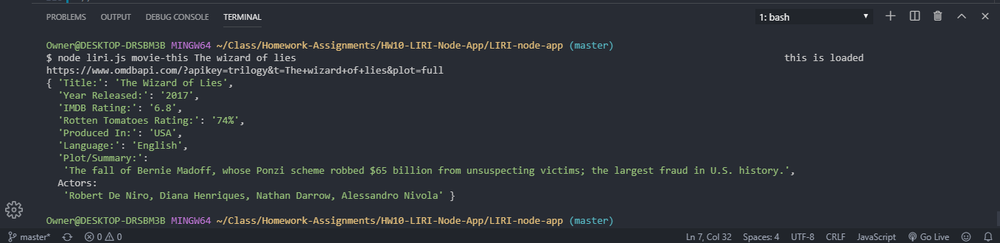
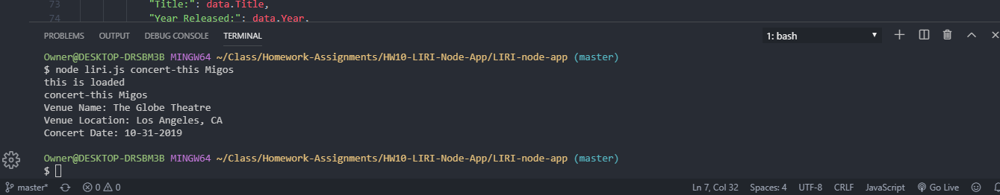
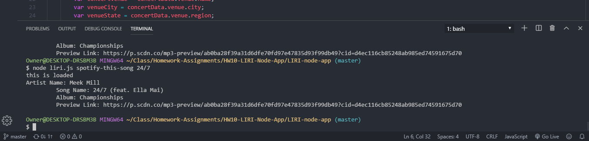

# LIRI-node-app

DEVELOPER: Andrew Fowose [https://github.com/usafowose/LIRI-node-app]

Function: ---------

The Language Interpretation and Recognition Interface (LIRI), is a command line interface (CLI) node app that takes in parameters and gives you back data from spotify, OMDB, and BandsinTown API's. It solves the problem of constantly using the front-end (GUI) to target and make API calls and instead, uses node.js on the back-end to make axios calls to these API's and returns data to the CLI. 
By passing basic commands to the CLI, you will be able to receive data about an artists' track (via Spotify), a bands next concert (via BandsinTown) or basic info about any movie (via OMDB). 

Instructions: -----------
1. To run the file, first navigate the the root directory in your CLI. 
2. In order to get the app functioning the first two commands must be "node liri.js". Note that this will only trigger default behavior as no purpose has been given to the application yet. 
3. To give the app functionality, after passing in the default commands for startup (node liri.js)

            ***(Exclude all end pointers (<,>) when passing commands to the CLI)***

    i. Movie Search: --> "movie-this name-of-movie" with the name-of-movie being any movie. 
    ii. Concert Search: --> "concert-this name-of-artist|band" with the name of artist or band being any. 
    iii. Song Search: --> "spotify-this-song name-of-song"

4. If data is returned, it should display on the CLI and in the log.txt file. 

Examples: ----------- Click for Picture Example
1. Movie Search: 
2. Concert Search: 
3. Song Search:  

Technologies Used: ------------

1. Node Javascript
2. Javascript (Vanilla)
3. File System Manager (fs)
4. Node Packet Manager (npm)
5. Axios 
6. Node-Spotify-Api
7. OMBD Api 
8. Dotenv Package
9. Moment.js

My Role: ---------------

I, Andrew Fowose, am the sole developer of this application. 

